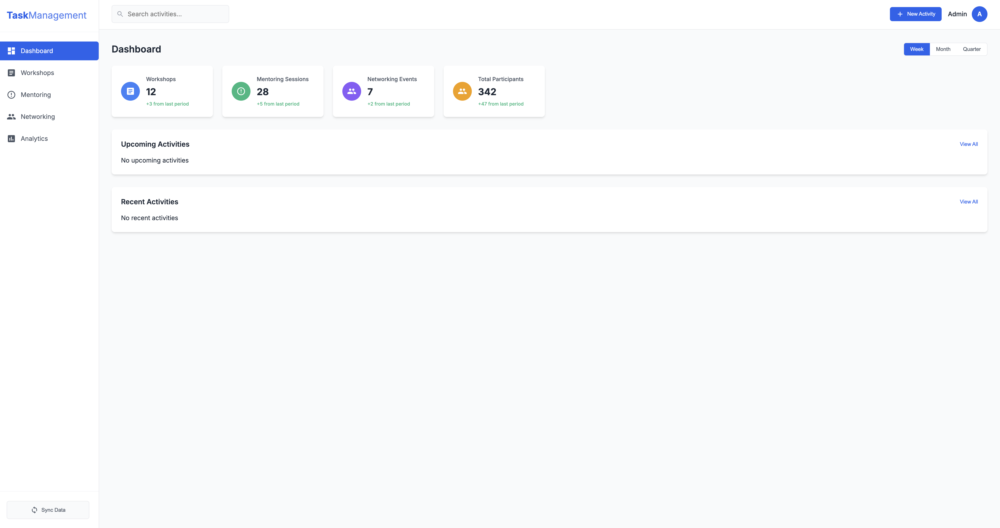

# Task Management System

A comprehensive task management system for activities, workshops, mentoring sessions, and networking events. Built with Node.js, Express, MongoDB, and vanilla JavaScript frontend.



## 🏗️ Architecture

This application follows a **monolithic architecture** with clear separation of concerns:

```
src/
├── config/          # Configuration files
│   └── database.js  # Database connection setup
├── controllers/     # Request handlers
│   └── activityController.js
├── models/          # Database models
│   └── Activity.js
├── routes/          # API route definitions
│   └── activityRoutes.js
├── services/        # Business logic layer
│   └── activityService.js
├── middleware/      # Custom middleware
│   └── errorHandler.js
├── utils/           # Utility functions
│   └── logger.js
├── public/          # Frontend assets
│   ├── assets/      # Images, icons, etc.
│   ├── js/          # JavaScript files
│   ├── css/         # Stylesheets
│   └── index.html   # Main HTML file
├── app.js           # Express app configuration
└── server.js        # Server entry point
```

## 🚀 Features

### Activity Management
- **Workshops**: Manage educational sessions with presenters and materials
- **Mentoring**: Track mentor-mentee relationships and focus areas
- **Networking**: Organize networking events with different formats

### Core Functionality
- ✅ Create, read, update, delete activities
- ✅ Complete and cancel activities
- ✅ Filter activities by type, status, date range
- ✅ Real-time synchronization with database
- ✅ Dashboard with upcoming and recent activities
- ✅ Statistics and analytics
- ✅ Responsive web interface

### API Endpoints

#### Activities
- `GET /api/activities` - Get all activities with optional filters
- `GET /api/activities/upcoming` - Get upcoming activities
- `GET /api/activities/recent` - Get recently completed activities
- `GET /api/activities/:id` - Get specific activity
- `POST /api/activities` - Create new activity
- `PUT /api/activities/:id` - Update activity
- `DELETE /api/activities/:id` - Delete activity
- `POST /api/activities/sync` - Bulk sync activities
- `POST /api/activities/:id/complete` - Mark activity as completed
- `POST /api/activities/:id/cancel` - Cancel activity

#### Additional Endpoints
- `GET /api/mentors` - Get list of mentors
- `GET /api/statistics` - Get activity statistics
- `GET /health` - Health check endpoint

## 🛠️ Installation

### Prerequisites
- Node.js >= 22.16.0
- MongoDB >= 7.0.0
- npm >= 11.4.1

### Setup

1. **Clone the repository**
   ```bash
   git clone <repository-url>
   cd task-management-system
   ```

2. **Install dependencies**
   ```bash
   npm install
   ```

3. **Environment Configuration**
   Create a `.env` file in the root directory:
   ```env
   # Server Configuration
   PORT=3000
   NODE_ENV=development

   # Database Configuration
   MONGODB_URI=mongodb://localhost:27017/task-management-system

   # CORS Configuration
   CORS_ORIGIN=http://localhost:3000
   ```

4. **Create logs directory**
   ```bash
   npm run logs
   ```

5. **Start the application**
   ```bash
   # Development mode with auto-reload
   npm run dev

   # Production mode
   npm start
   ```

## 🔧 Development

### Project Structure Explained

#### Backend Components

**Models (`src/models/`)**
- Define database schemas and business logic
- Include virtual properties, instance methods, and static methods
- Handle data validation and relationships

**Controllers (`src/controllers/`)**
- Handle HTTP requests and responses
- Validate input data
- Coordinate between services and routes

**Services (`src/services/`)**
- Contain business logic
- Handle complex operations and data processing
- Provide reusable functionality across controllers

**Routes (`src/routes/`)**
- Define API endpoints
- Apply middleware and validation
- Connect HTTP methods to controller functions

**Middleware (`src/middleware/`)**
- Handle cross-cutting concerns
- Error handling and logging
- Request validation and authentication

#### Frontend Components

**Classes (`src/public/js/webapp/classes.js`)**
- Activity and ActivityList classes
- Local data management
- Business logic for frontend operations

**API Service (`src/public/js/webapp/api-service.js`)**
- HTTP client for backend communication
- Handles all API calls
- Error handling and data transformation

**Command Pattern (`src/public/js/webapp/command.js`)**
- Implements command pattern for actions
- Undo/redo functionality
- Encapsulates user operations

### Key Design Patterns

1. **MVC Architecture**: Clear separation between Models, Views, and Controllers
2. **Service Layer**: Business logic abstraction
3. **Repository Pattern**: Data access abstraction through Mongoose models
4. **Command Pattern**: Frontend action management
5. **Singleton Pattern**: Activity list management
6. **Observer Pattern**: Event-driven UI updates

### API Design Principles

- **RESTful**: Following REST conventions for resource management
- **Stateless**: Each request contains all necessary information
- **Consistent**: Uniform response formats and error handling
- **Validated**: Input validation on all endpoints
- **Documented**: Clear endpoint documentation and examples

## 📊 Database Schema

### Activity Model
```javascript
{
  id: String (unique),
  type: String (workshop|mentoring|networking),
  title: String,
  date: String,
  time: String,
  description: String,
  location: String,
  capacity: Number,
  completed: Boolean,
  cancelled: Boolean,
  createdAt: String,
  completedDate: String,
  
  // Workshop specific
  presenter: String,
  materials: String,
  
  // Mentoring specific
  mentor: String,
  mentee: String,
  focus: String,
  
  // Networking specific
  format: String,
  partners: String
}
```

## 🔍 Monitoring and Logging

The application includes comprehensive logging using Winston:

- **Console Logging**: Development-friendly colored output
- **File Logging**: Persistent logs in `logs/` directory
- **Error Tracking**: Separate error log file
- **HTTP Logging**: Request/response logging with Morgan

Log levels: `error`, `warn`, `info`, `http`, `debug`

## 🚀 Deployment

### Docker Support
```bash
# Build image
docker build -t task-management-system .

# Run container
docker run -p 3000:3000 task-management-system
```

### Docker Compose
```bash
docker-compose up -d
```

### Environment Variables for Production
```env
NODE_ENV=production
PORT=3000
MONGODB_URI=mongodb://mongo:27017/task-management-system
CORS_ORIGIN=https://yourdomain.com
```

## 🧪 Testing

```bash
# Run tests
npm test

# Run linting
npm run lint
```

## 📈 Performance Considerations

- **Database Indexing**: Optimized queries with proper indexes
- **Bulk Operations**: Efficient bulk updates for sync operations
- **Connection Pooling**: MongoDB connection optimization
- **Error Handling**: Graceful error handling and recovery
- **Logging**: Structured logging for monitoring and debugging

## 🔒 Security Features

- **Input Validation**: Express-validator for request validation
- **Error Handling**: Secure error messages without sensitive data exposure
- **CORS Configuration**: Configurable cross-origin resource sharing
- **Environment Variables**: Sensitive data protection

## 🆘 Support

For support and questions:
- Check the logs in `logs/` directory
- Use the health check endpoint: `GET /health`
- Review the API documentation above
- Check MongoDB connection status 
